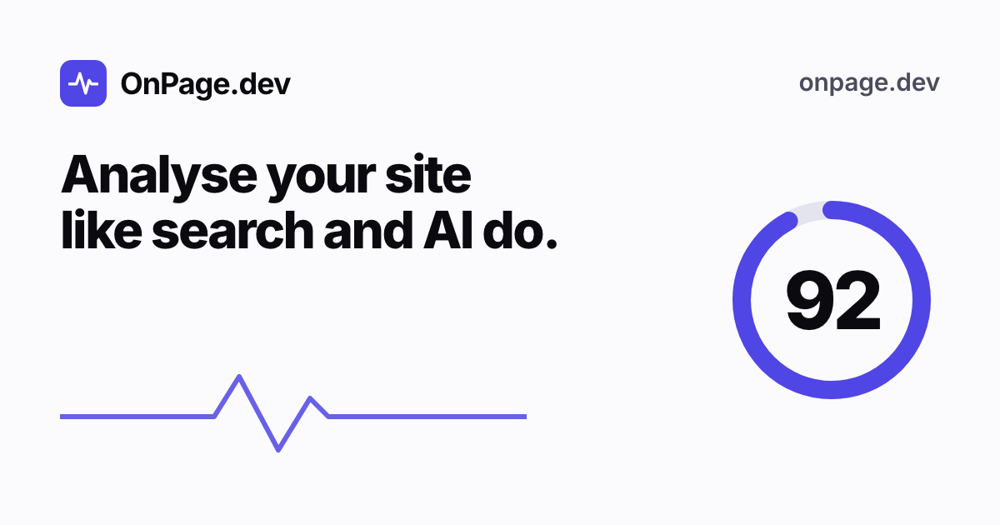
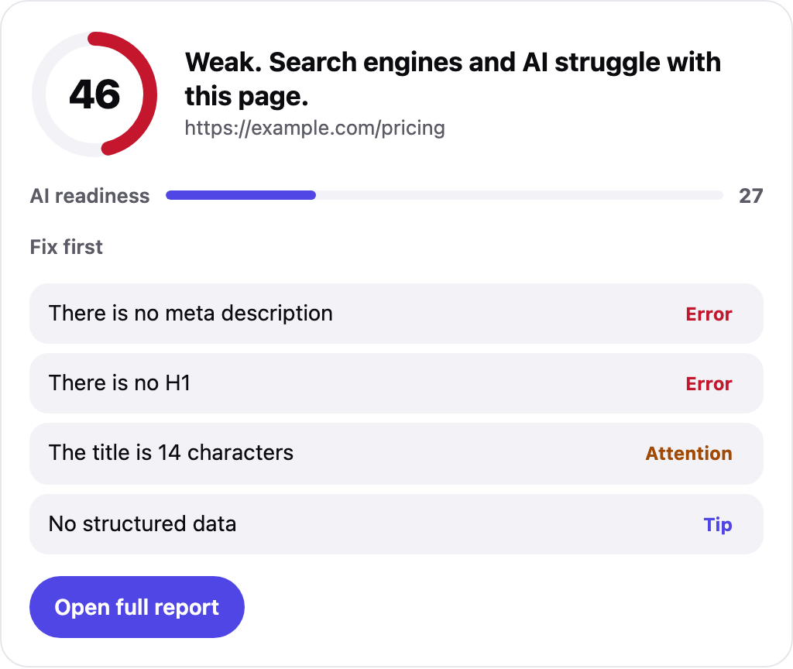

<p align="center">
  <a href="https://onpage.dev/mcp"></a>
</p>

<h1 align="center">OnPage.dev MCP server</h1>

<p align="center">
  <b>The SEO scanner your AI assistant uses to fix your site itself.</b><br>
  Scan, fix, check before deploy, confirm after. For Google and for AI search.
</p>

<p align="center">
  <a href="https://onpage.dev/mcp"></a>
  
  
  <a href="https://github.com/seoonpage/onpage-tools/actions/workflows/test.yml"></a>
  <a href="LICENSE"></a>
</p>

<p align="center">
  <a href="#install-in-one-minute">Install</a> ·
  <a href="#uses-the-seo-data-you-already-have">Your SEO data</a> ·
  <a href="#seen-by-every-reader">Every reader</a> ·
  <a href="#keeps-watching-after-you-ship">Watch and alerts</a> ·
  <a href="#built-for-agents">Built for agents</a> ·
  <a href="#what-it-can-do">Tools</a> ·
  <a href="#why-it-is-different">Why it is different</a> ·
  <a href="#claude-code-plugin">Claude Code plugin</a> ·
  <a href="#github-action-seo-gate">GitHub Action</a> ·
  <a href="https://onpage.dev">onpage.dev</a>
</p>

---

Most SEO tools give you a report. OnPage.dev gives your assistant something to **do**: write the fix, check it before you publish, and confirm it worked. It also checks what AI search sees, not only Google: which AI crawlers may read your site, whether your content is ready to be quoted, and whether you have an `llms.txt`.

```
You:        Fix the SEO on our pricing page and keep going until it scores 90 or more.

Assistant:  scan_page            46/100  no meta description, no H1, title 14 characters
            get_fix_pack         title, description and canonical, written from the page
            generate_schema      Product JSON-LD, 2 values to fill in
            (edits pricing.html)
            scan_html            92/100  before deploying, all errors gone
            rescan_and_compare   94/100  live, +48 since the first scan

            Done. 46 to 94. Two prices in the JSON-LD still need your real values.
```

## Seen by every reader

Google reads your HTML. Visitors see one screen on a phone. Screen readers, and AI agents that browse for people, read the accessibility tree. OnPage.dev checks all three in a real browser.

**`render_page`** loads the page on a phone, tablet and desktop and checks the first screen: is the H1 and the call to action visible without scrolling, does a cookie wall or pop-up cover it, are tap targets big enough, what shifts while loading. It loads the page again with JavaScript off to show what GPTBot and ClaudeBot miss, and checks whether the first screen delivers what the Google snippet promises. With screenshots.

**`screen_reader_view`** reads the page the way a screen reader announces it:

```
heading level 1, Running shoes for flat feet
link, Women
link                         ← announced without a name
button                       ← announced without a name
image, Trail shoe in grey mesh, side view
link, Read more              ← vague, and weak anchor text
```

It flags links and buttons without a name, vague link text, form fields without a label, a missing main landmark, skipped headings and visible text hidden from readers. Accessibility is not a direct Google ranking factor, but alt text, link text, headings and text that is not hidden are exactly what search engines, AI answer engines and browsing agents read. We ran it on our own news site and found three thumbnail links announced as just "link".

Have your own browser tool (Claude in Chrome, Playwright)? **`get_layout_probe`** gives a small measurement script and **`analyze_layout`** analyses its results: no daily limit, and it works on staging, localhost and pages behind a login.

## Uses the SEO data you already have

Already connected Google Search Console, GA4, Ahrefs or Semrush to your assistant? OnPage.dev tells the assistant to pull their numbers in, then `prioritize_fixes` ranks every fix by the traffic it can win. Nothing connected? It ranks by severity, as before. You do not set anything up.

```
You:        Audit example.com and tell me what to fix first.

Assistant:  start_site_audit     10 pages, average 81
            (Ahrefs) top pages   clicks, positions, keywords, referring domains
            prioritize_fixes     ranked by traffic impact

            1. /pricing is noindex but gets 900 visits a month. Fix this first.
            2. /results ranks #6 for "league table" (5,600 searches a month).
               Add the term to the H1 to push into the top 3, ~330 extra clicks.
            3. /guide shows up 20,000 times at position 3 but gets 0.2% clicks.
               Rewrite the title and description, test them with check_snippet.
```

How it works: an MCP server cannot read other connectors, and should not. OnPage.dev's results and instructions ask the assistant to fetch the numbers from any SEO data tool it has, and the assistant passes them to `prioritize_fixes`. The numbers are used for that answer only and never stored. OnPage.dev never logs in to those services.

### And what AI already cites

With Ahrefs Brand Radar (or any source of AI citation counts) connected, `compare_ai_citations` puts the pages ChatGPT, Perplexity, Gemini and Google AI cite next to the ones they skip. OnPage.dev scans every page and shows which checks the cited pages pass and the others fail, the averages side by side (AI readiness, words, facts per 100 words, outside sources, entity graph issues), and what each skipped page should change. It is honest about the limits: a correlation over a few pages, not proof of cause.

What `prioritize_fixes` looks for: blockers on pages with traffic, low click-through for the position, keywords in striking distance (position 4 to 15), top queries missing from the title or H1, and pages with strong backlinks that score badly.

## Keeps watching after you ship

Most SEO problems are not there on launch day. They arrive later: a deploy adds `noindex`, a CMS update changes the canonical, a new robots.txt blocks GPTBot. `watch_page` rechecks a page about once a day and records every change for search and AI. Alerts go to a private RSS feed and, if you give one, a Slack or Discord webhook. No account, no key.

```
You:        Keep an eye on our pricing page and tell me if anything breaks.

Assistant:  watch_page           baseline 94/100, 8 of 8 AI crawlers allowed
            ...three days later, in your Slack:
            OnPage.dev: 2 change(s) on https://example.com/pricing
            - A noindex tag was added: the page will drop out of Google
            - The score went from 94 to 71
```

And three more jobs agents get asked to do every week:

- **`create_content_brief`**: give a search term and the pages that rank, get a writing brief: the subtopics most of them cover, the questions they answer, figures to back up with your own data, a target length, schema and internal links. Bot walls and navigation headings are filtered out.
- **`plan_redirects`**: give the old and new URLs (or the sites, to read their sitemaps) and get a 301 map with a confidence score per match, written as `_redirects`, nginx, Apache, Next.js or CSV. Then verify after launch with `check_urls`.
- **`share_result`**: after fixing a site, publish a before and after page (for example 46 → 94, with the issues fixed) to send to your client. Not indexed, expires after 90 days.

## Built for agents

What makes OnPage.dev different from every other SEO MCP server:

- **Sees every reader.** First screen on phone, tablet and desktop in a real browser, and the page read aloud like a screen reader. [More](#seen-by-every-reader).
- **Keeps watching.** `watch_page` catches regressions after launch and alerts by RSS or webhook. [More](#keeps-watching-after-you-ship).
- **Uses the data you already have.** Search Console, GA4, Ahrefs or Semrush in the same chat? `prioritize_fixes` ranks every fix by traffic impact with their numbers, and `compare_ai_citations` shows what the pages AI cites do differently. [How it works](#uses-the-seo-data-you-already-have).
- **Stable issue codes and typed results.** Every issue has a fixed code like `meta-missing` or `h1-missing`, and the main tools declare an output schema. An agent can work through issues one by one and prove each one is gone.
- **It checks the code the agent writes.** `scan_html`, `validate_schema` and `compare_html` test new HTML and JSON-LD before it ships, and catch regressions such as a stray `noindex` or a removed canonical.
- **Launch and migration built in.** `check_urls` follows every redirect chain for up to 20 URLs at once; `test_robots` answers "may this bot fetch this URL" with Google's own matching rules, including `*` and `$` wildcards.
- **Whole sites, step by step.** `start_site_audit` runs as a job the agent works through, so a 25-page audit fits a free hosted service. It reports issues across the site by code, broken and orphan pages and duplicates.
- **You vs the pages that rank.** `compare_pages` puts a page next to up to 3 competitors with content gaps and fixes to catch up; `suggest_internal_links` shows which pages should link where.
- **Knowledge graph ready.** `check_entity_graph` checks that your Organization and authors are real, linked entities with profile links, not just valid markup. `validate_llms_txt` catches the common case where /llms.txt returns an HTML page.
- **Citability, not just crawlability.** AI readiness checks fact density, cited outside sources and whether every question heading gets a direct answer. `compare_pages` shows the facts and figures only a competitor gives, and the ones only you give: information gain, measured against the pages that rank.
- **No made-up advice.** The `onpage://rules` resource gives the assistant every check, threshold and fix, so it explains SEO from the same rules the scanner uses.
- **Free and hosted.** Paste one URL. No account, no API key, no install.

## Install in one minute

The server is hosted. There is nothing to install or run, and no key.

**Server URL:** `https://onpage.dev/mcp`

<details open>
<summary><b>Claude Code</b></summary>

```bash
claude mcp add --transport http onpage https://onpage.dev/mcp
```

Or install the [plugin](#claude-code-plugin) for the server plus ready commands and skills.
</details>

<details>
<summary><b>Claude (claude.ai and desktop)</b></summary>

Settings → Connectors → **Add custom connector** → paste `https://onpage.dev/mcp` → save. Turn the connector on in a chat.
</details>

<details>
<summary><b>ChatGPT</b></summary>

Add a custom connector with `https://onpage.dev/mcp` (Settings → Connectors, with developer mode on). Which plans can use custom connectors is up to OpenAI.
</details>

<details>
<summary><b>Cursor</b></summary>

`~/.cursor/mcp.json` or `.cursor/mcp.json` in your project:

```json
{
  "mcpServers": {
    "onpage": { "url": "https://onpage.dev/mcp" }
  }
}
```
</details>

<details>
<summary><b>VS Code</b></summary>

`.vscode/mcp.json`:

```json
{
  "servers": {
    "onpage": { "type": "http", "url": "https://onpage.dev/mcp" }
  }
}
```
</details>

<details>
<summary><b>Any other MCP client</b></summary>

Streamable HTTP transport at `https://onpage.dev/mcp`. JSON responses, no authentication.
</details>

## What it can do

34 tools in five jobs. Every result links to the full visual report on [onpage.dev](https://onpage.dev). Issues carry stable codes; the full list is in the `onpage://rules` resource.

### Audit and fix

| Tool | What it does | Example result |
|---|---|---|
| `scan_page` | Score from 0 to 100, the issues to fix first with why and how, AI readiness and key facts | `46/100, 5 fixes` |
| `deep_audit` | Everything measured, by section: speed hints, links and anchor texts, accessibility, image SEO, rich results, security headers, content and technical facts | `8 sections` |
| `get_fix_pack` | Ready-to-paste HTML for every issue, written from the page's own content | `<title>`, `<meta>`, canonical, social tags |
| `generate_schema` | Article, Product, FAQ, Organization or breadcrumb JSON-LD, validated against Google's rich result rules. Values it cannot read are marked TODO, never invented | `Product: eligible` |
| `rescan_and_compare` | Scan again after a fix: score change, what got fixed, what is new | `46 → 94` |
| `share_result` | A public before and after page to send to a client: score change, fixed and open issues. Not indexed, expires after 90 days | `46 → 94, shareable` |
| `render_page` | The first screen on phone, tablet and desktop in a real browser: H1 and call to action position, cookie walls and pop-ups, tap targets, small text, layout shift, JavaScript-only content, snippet match. With screenshots | `CTA below the fold on phone` |

### Whole site and competitors

| Tool | What it does | Example result |
|---|---|---|
| `start_site_audit` | Audit up to 25 pages from the sitemap as a job. Returns an `audit_id` and the first progress | `3 of 25 scanned` |
| `get_site_audit` | Continue until complete, then read the site-wide results: issues by code with affected pages, broken, orphan and duplicate pages | `25 pages, average 92` |
| `suggest_internal_links` | Which audited pages should link to a page, with anchor text. Works for a new page by topic | `3 links to add` |
| `prioritize_fixes` | Rank fixes by traffic impact, using numbers from your connected Search Console, GA4, Ahrefs or Semrush: blockers, low CTR, striking distance, missing keywords, strong links on a weak page. Falls back to severity | `#6 → top 3, ~336 clicks/mo` |
| `compare_pages` | A page next to up to 3 competitors: side by side, content gaps, structured data they have and fixes to catch up. Flags cookie walls | `You lead on 12 of 14` |

### AI search

| Tool | What it does | Example result |
|---|---|---|
| `check_ai_visibility` | Which AI crawlers may read the page (GPTBot, ClaudeBot, PerplexityBot, Google-Extended and more), llms.txt, 14 checks for AI answers, and the page as a model reads it | `7 of 8 crawlers allowed` |
| `find_answer_passages` | Does the page answer a question well enough for AI to quote it? Returns the best passages with length and fit | `Best passage, 64 words` |
| `ai_crawler_policy` | robots.txt rules for 13 AI crawlers from a policy (allow all, AI search only, block all), merged into your existing file | `13 bots, merged` |
| `generate_llms_txt` | A ready `llms.txt` built from the sitemap and home page | `llms.txt, 42 pages` |
| `validate_llms_txt` | Check an llms.txt against the llmstxt.org format: a real text file (not an HTML soft 404), one title, a summary, sections with `[name](url): notes` links, size, dead links, and whether llms-full.txt exists. Validates drafts too | `Valid, 6 sections, 8 of 8 links load` |
| `check_entity_graph` | How the structured data describes who is behind a page, the way AI knowledge graphs read it: Organization, author and publisher as linked entities (`@id`), `sameAs` profiles that load, a match with the home page, and the missing JSON-LD with TODOs | `5 entities, 1 fix: no sameAs` |
| `screen_reader_view` | How screen readers and browsing AI agents read the page: landmarks, heading outline, every link, button, image and field with its name, and what is missing | `3 links without a name` |
| `compare_ai_citations` | AI citation counts per page from Ahrefs Brand Radar or another source, next to OnPage.dev checks: which checks the cited pages pass and the others fail, averages side by side, and what each skipped page should change | `Clear answer first: 100% of cited pages vs 0%` |
| `watch_page` / `get_watch` / `unwatch` | A daily check for regressions: page down or redirected, noindex added, AI crawlers blocked, canonical or title changed, score drop, new and fixed issues. Private RSS feed, optional Slack or Discord webhook | `noindex added, alert sent` |

### Launch and migration

| Tool | What it does | Example result |
|---|---|---|
| `check_urls` | Status codes and full redirect chains for up to 20 URLs, checked against where each should land. Flags chains and temporary redirects | `19 of 20 OK` |
| `plan_redirects` | Old URLs to new ones with a confidence score per match, written as `_redirects`, nginx, Apache, Next.js or CSV rules | `212 matched, 9 to review` |
| `test_robots` | May Googlebot, GPTBot, ClaudeBot or any crawler fetch this URL? Uses Google's matching rules and returns the exact deciding rule. Can test a proposed robots.txt too | `Blocked by "Disallow: /search?"` |

### Writing and code

| Tool | What it does | Example result |
|---|---|---|
| `scan_html` | Scan HTML that is not live yet: a local build, a template or a draft. Same score and fixes as `scan_page` | `92/100 before deploy` |
| `compare_html` | SEO diff between two versions of a page: score, issues fixed and introduced (by code), and changes to title, description, H1, canonical, robots and structured data | `72 → 18, noindex added` |
| `validate_schema` | Check JSON-LD you wrote: syntax, @context and @type, ISO dates, absolute URLs, placeholders and Google's required fields | `2 errors, 3 warnings` |
| `check_focus_keyword` | Eight checks for one search term: title, description, H1, URL, opening text, subheadings, alt texts and keyword use | `6 of 8` |
| `check_snippet` | Pixel-width estimate of title and description against Google's cut-off, desktop and mobile | `612 px, cut off` |
| `create_content_brief` | A writing brief from the pages that rank: subtopics, questions, figures, target length, schema, title patterns and internal links | `8 topics, 5 questions` |
| `get_layout_probe` / `analyze_layout` | Run the first-screen checks in your own browser tool: no daily limit, works on staging and localhost | `First screen, 3 devices` |

### Ready workflows (MCP prompts)

One click in clients that show prompts:

- **Full SEO and AI audit**: scan, AI check and fix pack, then a prioritised plan.
- **Why can't AI find my site?**: which assistants can read and quote you, and what to change.
- **Launch checklist**: a tick or cross for everything a page needs before going live.
- **AI visibility makeover**: robots.txt, llms.txt and answer passages in one go.
- **Pre-deploy SEO gate**: scan the built HTML and block the release below a minimum score.

### Reference resource

`onpage://rules`: every check with its stable code, why it matters and how to fix it, plus the key thresholds (title and description length in pixels, word counts, alt text, server response, AI answer length).

### Score card in the chat

In clients that support MCP Apps (Claude) or the Apps SDK (ChatGPT), scan results also show as a visual card:

<p align="center"></p>

## Why it is different

|  | OnPage.dev | Data vendor MCPs (Ahrefs, Semrush and similar) | Self-hosted audit servers |
|---|---|---|---|
| Price | Free | Paid plan or API credits | Free |
| Setup | Paste one URL | Account and key | Install and run yourself, often extra API keys |
| Built for | Acting on results: fix, check before deploy, confirm | Research data: keywords, backlinks, rankings | Audits and reports |
| Scan unpublished HTML | Yes, `scan_html` and `compare_html` | No | Rarely |
| Agent-grade output | Stable issue codes, output schemas, rules resource | Data rows | Varies |
| Migration checks | Redirect chains, robots.txt tester | Partly | Partly |
| Whole-site audit | Up to 25 pages, free, as a job | Yes, paid | Yes, self-run |
| Competitor gaps | Page vs page, with content gaps | Keyword and backlink gaps | Rarely |
| AI search tools | Crawler access, AI-answer checks, robots.txt policy, llms.txt | AI visibility tracking on some | Rarely |
| Ready code | Fix pack, JSON-LD, robots.txt, llms.txt | No | Varies |
| Uses your traffic data | Yes, from GSC, GA4, Ahrefs or Semrush already in the chat | Their own data | Rarely |
| Explains AI citations | Cited vs skipped pages, checked side by side | Citation counts only | No |
| Monitoring and alerts | Daily watch, RSS and webhook, free | Yes, paid | Rarely |
| Real-browser first screen | Phone, tablet, desktop, with and without JavaScript | No | Rarely |
| Screen reader view | Accessibility tree read aloud, unnamed controls flagged | No | Rarely |
| Migration redirect map | Old to new with confidence, ready rules | No | Rarely |

What OnPage.dev does not have: its own search volumes, rankings or backlinks. Connect a data vendor in the same chat and OnPage.dev turns their numbers into ranked fixes.

## Example prompts

```
Why does ChatGPT never mention example.com? Check it with OnPage.dev.
Scan our pricing page and give me the five fixes with the code.
Let ChatGPT search read our site but block AI training. Write the robots.txt.
We moved to a new URL structure. Check that these 20 old URLs redirect to the right new pages.
Review this pull request for SEO regressions: compare the old and new HTML of the changed pages.
Audit our whole site and tell me the three fixes that help the most pages at once.
We are writing a page about trail running shoes. Which of our pages should link to it?
How does our pricing page compare with these two competitors, and what are we missing?
Does our blog post answer "how long does shipping to Germany take" well enough for AI to quote?
Write three title options for this page and check which ones fit in Google.
Fix the SEO issues in this project, check the build with OnPage.dev and keep going until it scores 95.
```

## Claude Code plugin

The server plus commands and skills that run the fix loop for you.

```
/plugin marketplace add seoonpage/onpage-tools
/plugin install onpage@onpage-dev
```

- `/seo-check [url or path]`: scan a live page, or find this project's built HTML and scan that, then fix what is wrong.
- `/ai-visibility`: check whether ChatGPT, Claude, Perplexity and Gemini can read and quote the site, and write `robots.txt` and `llms.txt`.
- **seo-fix-loop** skill: fixes in your source (templates, Next.js `metadata`, Astro frontmatter), checks with `scan_html` before deploy and confirms with `rescan_and_compare` after.

About 300 tokens of always-on context.

## GitHub Action: SEO gate

Scans the HTML your build produces on every pull request, comments the scores and top fixes, and fails when a page drops below your minimum.

```yaml
name: SEO gate
on: pull_request
permissions:
  contents: read
  pull-requests: write
jobs:
  seo:
    runs-on: ubuntu-latest
    steps:
      - uses: actions/checkout@v5
      - run: npm ci && npm run build
      - uses: seoonpage/onpage-tools@v1
        with:
          paths: "dist/**/*.html"          # built HTML to check
          base-url: "https://example.com"   # optional, for canonical and relative links
          min-score: "80"                   # fail below this
          max-files: "10"                   # about 20 scans per minute
```

The pull request gets a comment like this, updated on every push:

> ### ❌ OnPage.dev SEO gate: lowest score 36 (minimum 80)
> | Page | Score | AI readiness | Fix first |
> |---|---:|---:|---|
> | `dist/about/index.html` | **36** | 0 | There is no meta description; There is no H1; The title is 5 characters |
> | `dist/index.html` | 90 | 22 | Thin content: 32 words; No structured data; Open Graph is incomplete |

## Security and privacy

- **Read-only.** Every tool only reads public pages or the HTML you send. Nothing is changed anywhere.
- **Public pages only.** Private, internal and local network addresses are refused (SSRF protection), and so are non-web schemes.
- **No storage of content.** HTML sent to `scan_html` is analysed in memory and dropped. For change tracking, only the score and issue names are kept, under a hashed key, for up to 30 days.
- **Your traffic data stays yours.** Numbers passed to `prioritize_fixes` are used for that answer only. OnPage.dev never connects to Search Console, GA4, Ahrefs or Semrush itself.
- **Prompt injection aware.** Text from scanned pages is returned as data and marked as such.
- **Fair use limits.** About 20 scans per minute per connection, plus a shared cap. No accounts, no keys, no tracking cookies.

Full details: [onpage.dev/privacy](https://onpage.dev/privacy) and [onpage.dev/terms](https://onpage.dev/terms).

## Limits

- Reads the HTML a server returns. JavaScript is not run, so content that only appears in the browser is not seen.
- Link checks, image sizes and AI crawler access need a live URL, so `scan_html` skips them.
- Pixel widths in `check_snippet` are an estimate; Google can also rewrite snippets.

## Links

- Web app: [onpage.dev](https://onpage.dev)
- MCP server and setup: [onpage.dev/mcp](https://onpage.dev/mcp)
- Questions: [hi@onpage.dev](mailto:hi@onpage.dev) or [open an issue](https://github.com/seoonpage/onpage-tools/issues)

## License

MIT
